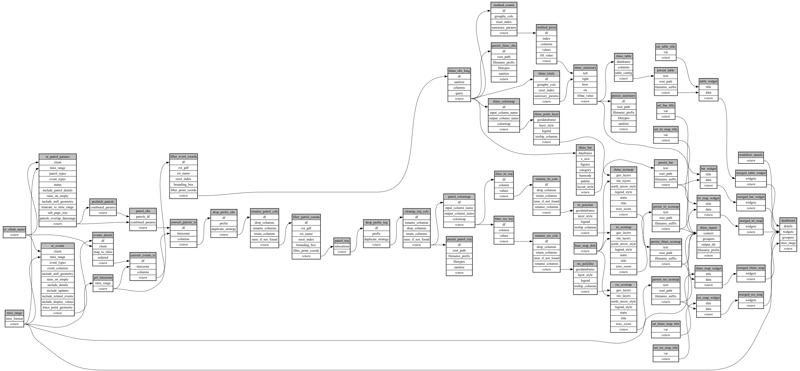

```
# AUTOGENERATED BY ECOSCOPE-WORKFLOWS; see fingerprint in README.md for details

```

```yaml
# fingerprint:
artifacts_sha256_basic: 20c206c7d5df9706ea8efbc6c39c3b7c4356e8abdfd38f829a48b4d2ca9b9a44
artifacts_sha256_strict: 1d0fa23a69afecf810c93f3d11dacf9ade908be4d4a51574381e19976fe5b36f
installed_requirements:
- channel: conda-forge
  name: setuptools
  version: {version: ==81.0.0}
- channel: https://repo.prefix.dev/ecoscope-workflows/
  name: lonboard
  version: {version: ==0.0.8}
- channel: conda-forge
  name: numpy
  version: {version: ==2.0.2}
- channel: conda-forge
  name: pyarrow
  version: {version: ==23.0.1}
- channel: conda-forge
  name: rasterio
  version: {version: ==1.4.4}
- channel: conda-forge
  name: pydeck
  version: {version: ==0.9.2}
- channel: conda-forge
  name: pydantic
  version: {version: ==2.8.2}
params_sha256: c3b69f64645b2d76a0abbcb17edd1bb72453d062cd567cae55966ef87a205a17
spec_sha256: a694b72b4270c69b8125969065b9053d93f58bed4e4ae2a1e81be36711ad8bd8

```

# ecoscope-workflows-mt-rhino-workflow


